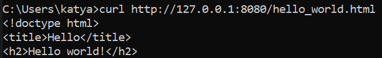
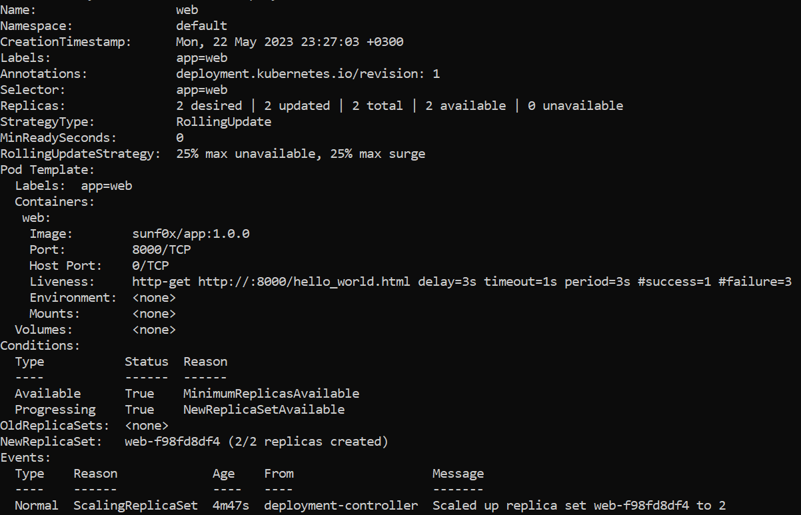

# Kubernetes. Домашнее задание.
## Выполнение
1) Создали `Dockerfile` согласно инструкции
2) Создали `hello_world.html`, который выводит фразу Hello world! на страницу
3) Запустили команду создания нового образа с тегом
```
docker build -t sunf0x/app:1.0.0 --network host -t sunf0x/app:latest .
```
4) Использовали образ для создания контейнера и проверки работоспособности
```
docker run -ti --rm -p 8000:8000 --name app --network host sunf0x/app:1.0.0
```
5) Сделали пуш и пул образа в Docker Hub
```
docker push sunf0x/app:1.0.0
docker pull sunf0x/app:1.0.0
```
6) Установили minicube и запустили в докере ( потому что в Windows иначе возникают конфликты с wsl2 )
```
minikube start --driver=docker
```
7) Создали Kubernetes Deployment manifest согласно инструкции
8) Выполнили команду ниже
```
kubectl apply -f deployment.yaml
```
Получили: deployment.apps/web created

9) Далее ввели:
```
kubectl port-forward --address 0.0.0.0 deployment/web 8080:8000
```
10) Выполнили проверку работы:
```
curl http://127.0.0.1:8080/hello_world.html
```
Получили

11) Запустили
```
kubectl describe deployment web
```

